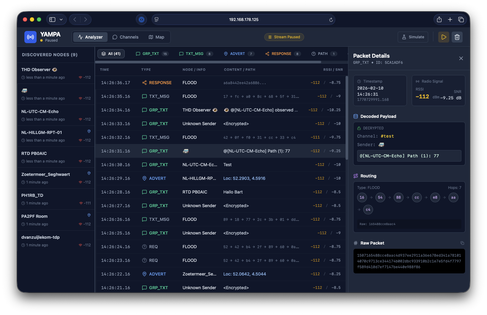
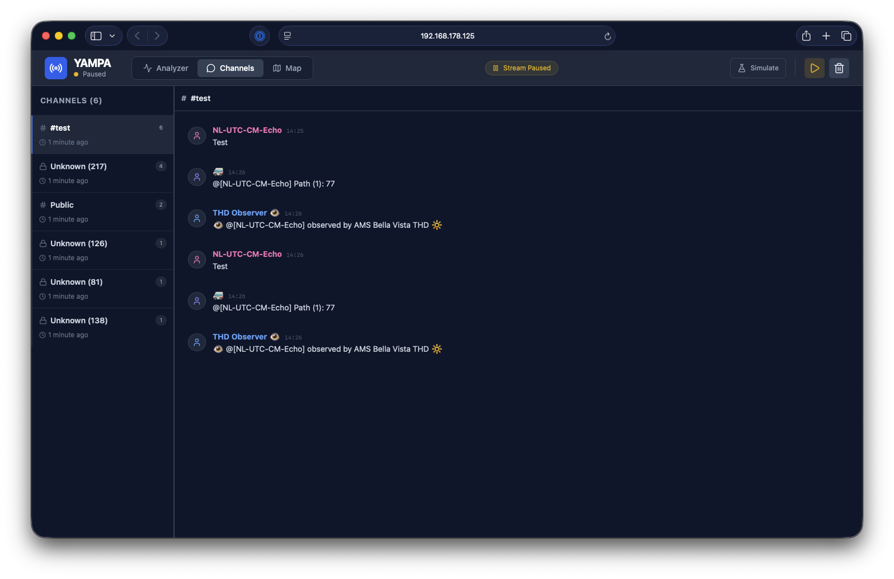
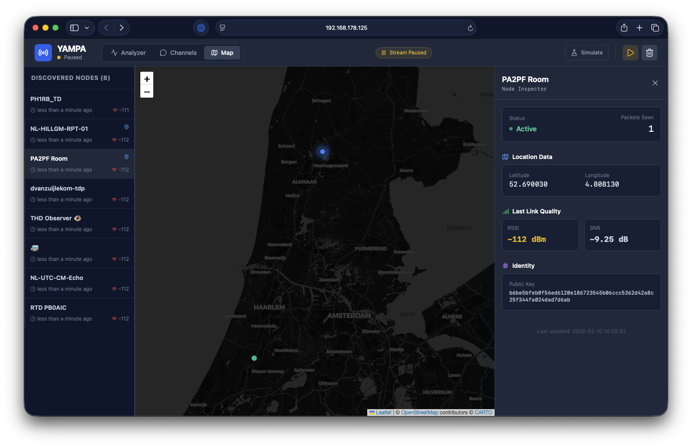

# YAMPA

YAMPA is Yet Another Meshcore Packet Analyser.



This repository contains:

- A React frontend UI.
- A Python WebSocket server implementation in `server-pymc_core/`.

The frontend expects a WebSocket endpoint that streams packet events as JSON.

## Server (WebSocket packet stream)

The reference server implementation lives at `server-pymc_core/server.py`.

It is intended to run on a supported Linux host with compatible radio hardware (for example, a Raspberry Pi with a supported LoRa chip). **The server and frontend do not need to run on the same machine.**

### WebSocket endpoint

- **URL:** `ws://<host>:<port>/ws`
- **Default:** `ws://localhost:8080/ws`

### Running the server

Run it on the machine that has access to the radio hardware:

```bash
python3 server-pymc_core/server.py --host 0.0.0.0 --port 8080
```

If your radio requires selecting a type/serial port, pass them explicitly:

```bash
python3 server-pymc_core/server.py --radio-type uconsole --serial-port /dev/ttyUSB0
```

## Frontend

### Run locally

**Prerequisites:** Node.js

1. Install dependencies:
   `npm install`
2. Set the `GEMINI_API_KEY` in [.env.local](.env.local) to your Gemini API key
3. Run the app:
   `npm run dev`

## Connecting the frontend to a remote server

By default, the frontend connects to `ws://localhost:8080/ws`.

If the server runs on a different machine (for example, the server on a Raspberry Pi and the frontend on your laptop), you must proxy the WebSocket endpoint so the browser can reach it.

### Option A: SSH tunnel (quick dev setup)

Forward your local port `8080` to the remote server’s `8080`:

```bash
ssh -N -L 8080:localhost:8080 pi@<server-host>
```

Then keep the frontend pointing at `ws://localhost:8080/ws`.

### Option B: Nginx reverse proxy (recommended)

Terminate HTTP(S) at Nginx and proxy the WebSocket upgrade to the server. Example:

```nginx
server {
  listen 80;
  server_name yampa.example.com;

  location /ws {
    proxy_pass http://127.0.0.1:8080/ws;
    proxy_http_version 1.1;
    proxy_set_header Upgrade $http_upgrade;
    proxy_set_header Connection "upgrade";
    proxy_set_header Host $host;
  }
}
```

From the browser you would then connect to `ws://yampa.example.com/ws` (or `wss://...` if served over TLS).

## Screenshots

### Channels



### Map



## License

This project is licensed under the GNU General Public License v3.0 (GPLv3). See [LICENSE](LICENSE).
